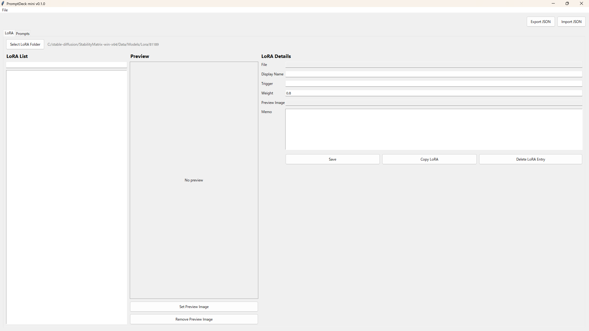

# PromptDeck mini

PromptDeck mini is a lightweight local LoRA and prompt snippet manager for AI image workflows.

It is a small, public-friendly edition focused on local LoRA browsing, thumbnail previews, prompt snippets, and one-click copy workflows.

## Screenshot



## Features

* Scan a local LoRA folder
* Show preview thumbnails from same-name images
* Edit trigger word, weight, and memo
* Copy LoRA snippets with one click
* Save and manage prompt snippets
* Copy prompt text with one click
* Import/export JSON
* Hide LoRA entries from the app list without deleting actual files
* Local-only storage

## Install

PromptDeck mini requires Python 3.10 or later.

Install the optional image preview dependency:

```powershell
pip install -r requirements.txt
```

Start the app:

```powershell
python promptdeck_mini.py
```

On Windows, you can also run:

```powershell
.\start.bat
```

`Pillow` enables better thumbnail display for `.jpg`, `.jpeg`, and `.webp` previews. The app can still start without it, but preview support is more limited.

## Usage

### LoRA

1. Open the **LoRA** tab.
2. Click **Select LoRA Folder** and choose a local folder containing `.safetensors`, `.pt`, or `.ckpt` files.
3. Select a LoRA from the list.
4. Edit the trigger word, weight, memo, or preview image.
5. Click **Save**.
6. Click **Copy LoRA** to copy a snippet.

Example copied LoRA snippet:

```text
<lora:sample_lora:0.8>, trigger_word
```

If `trigger_word` is empty, the copied text does not include a trailing comma:

```text
<lora:sample_lora:0.8>
```

To hide a LoRA from the app list, select it and click **Delete LoRA Entry**.

This only hides the entry in PromptDeck mini and removes its saved metadata. It does not delete the actual LoRA file or any preview image files.

Use **File > Reset Hidden LoRAs** to show hidden LoRA entries again.

### Prompts

1. Open the **Prompts** tab.
2. Click **Add Prompt**.
3. Enter a title, category, prompt text, and memo.
4. Click **Edit / Save**.
5. Use category filtering or search to find prompts.
6. Click **Copy Prompt** to copy the prompt text.

## Data Storage

PromptDeck mini stores data locally as JSON:

```text
data/promptdeck-mini.json
```

The JSON file stores:

* LoRA folder path
* Hidden LoRA paths
* LoRA trigger, weight, memo, and preview image path
* Prompt snippets

`data/` is ignored by Git because it may contain personal local paths and prompt data.

A public sample file is included at:

```text
sample-data/promptdeck-mini.sample.json
```

## Privacy / Local-only

PromptDeck mini stores all data locally and does not send files, prompts, or LoRA information to any server.

No database, cloud sync, login, or API key is required.

## Difference from Full PromptDeck

PromptDeck mini intentionally stays small.

PromptDeck mini includes:

* LoRA folder browser
* Thumbnail preview
* LoRA snippet copy
* Prompt snippet copy
* Local JSON storage

Full PromptDeck may include:

* Prompt builder
* Wildcard manager
* Advanced categories
* Multiple preview images
* Civitai import
* Prompt history
* Image/result management
* Bulk management

## License

MIT License. See [LICENSE](LICENSE).
